# HW 2 Solution

В репозитории не подтянулся нужный сабмодуль, поэтому я его сделал сам. Топик, соответственно, тоже не создаётся, его я сделал ручками в kafka-ui.

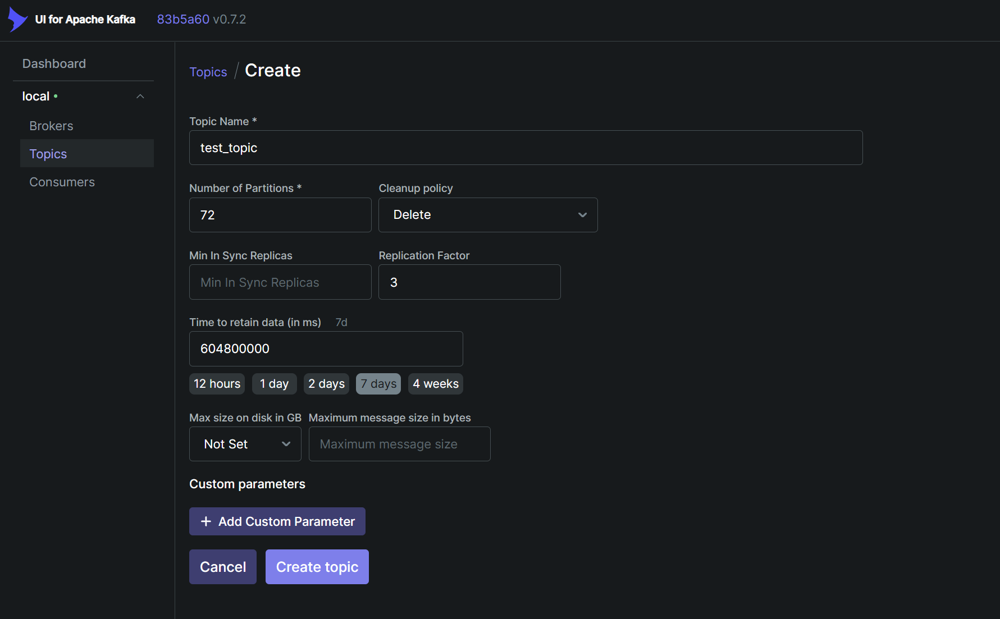

Также в Dockerfile этого репозитория поменял базовый образ для сборки на `openjdk:26-ea-24-jdk-slim-bookworm`

### Характеристики топика

1. Topic name

Взял имя топика из НТ.

2. Количество партиций: 72

Я задал топик с большим количеством партиций, так как это увеличивает параллелизм. Чем больше количество партиций, тем больше консьюмеров одновременно могут читать из топика и тем больше продьюсеров могут в него писать.
Все сообщения, попадающие в топик, должны быть последовательно записаны в сегменты. У каждой партиции есть свой активный сегмент. Следовательно, чем больше активных сегментов, тем выше параллелизм.
Количество партиций желательно делать кратным количеству брокеров (в нашем случае 72 % 3 == 0).

1. Cleanup policy: Delete

Что делать с сегментами по истечению retention. Можно сжать, либо удалить.

4. Min insync replicas

Не задавал эту настройку, по дефолту равна (количество брокеров - 1). Равна 2 в нашем случае. Минимальное количество реплик, синхронизированных с мастером для того, чтобы кластер считался здоровым.

5. Replication Factor: 3

Каждая партиция хранится на трёх брокерах. На одном из брокеров в неё пишет консьюмер, а на две другие она реплицируется для сохранности данных. Если какой-то из брокеров выпадает, то можно продолжать читать/писать из/в реплицированной партиции, но уже на другом брокере.
У этого есть и минус - увеличивается нагрузка на сеть, т.к. при записи одного сообщения его надо реплицировать ещё на 2 брокера.
Эта настройка реализует отказоустойчивость. Наш топик отказоустойчивый, так как мы можем выдержать падение даже двух брокеров (на последнем все равно будет копия всех партиций), правда он может взорваться от нагрузки...
В настройках брокера можно задать offsets.commit.required.acks, эта настройка включает ожидание подтверждения синхронизации реплик. Это надёжнее, но замедляет работу с кафкой.

6. Time to retain data: 7d

Kafka будет автоматически удалять старые логи, чтобы не хранить ненужные данные на диске. Если поставить маленькое значение, в случае выпадания консьюмеров какие-то данные могут потеряться.

7. Max size on disk

Максимальный размер лога на диске. Настройка аналогична предыдущей, только данные удаляться будут не по истечению времени, а по истечению места на диске.

## НТ

Состояние брокеров до НТ:

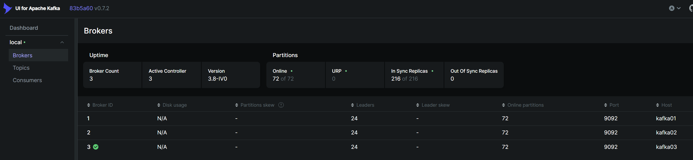

Запуск скрипта с НТ:

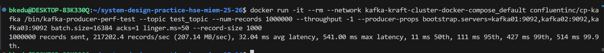

После НТ:
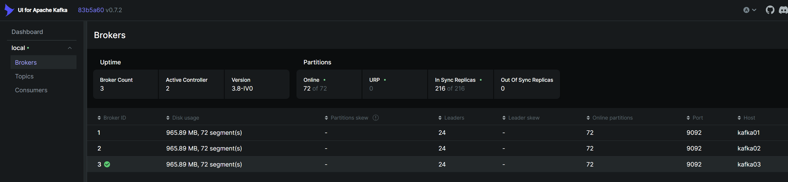

1. RPS (Records Per Second): 217202.4 records/sec
2. Throughput: 207.14 MB/sec
3. Latency:

|avg|max|p50|p95|p99|p99.9|
|-|-|-|-|-|-|
|32.04ms|541.00ms|11ms|111ms|427ms|514ms|

p50 = 11ms — половина сообщений отправляется довольно быстро

avg = 53ms — растёт из-за больших батчей (linger.ms=50)

p95, p99, p99.9 — скорее всего это сообщения, ожидающие формирования батча

Благодаря репликации на всех брокерах есть все события (на скрине "после НТ" у всех брокеров одинаковый disk usage). Мы отправили 1000000 сообщений по 1000 байт каждое ~= 1 ГБ. И такое использование на каждом брокере, что говорит о том, что все данные присутствуют на каждом из них.

Все реплики синхронизированы (in sync replicas == 216/216).

## Тест на отказоустойчивость

Пересоздал кластер, на начало теста имеем чистых брокеров. Лидер кластера - kafka02.

Имеем лидера kafka02

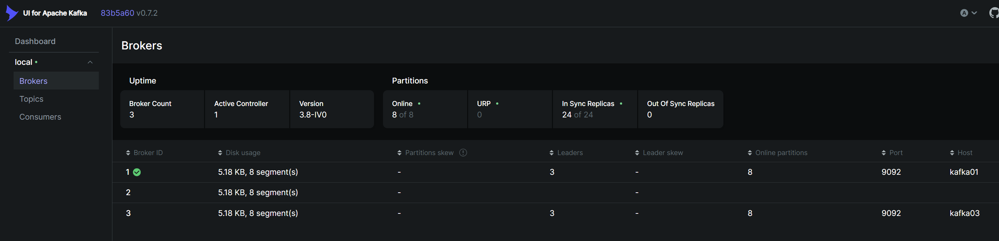

В фоне запущен скрипт. На брокерах видим растущее потребление дискового пространства.

Убиваю контейнер kafka02. Спустя несколько секунд в kafka-ui этот брокер пропадает, лидером становится kafka01.

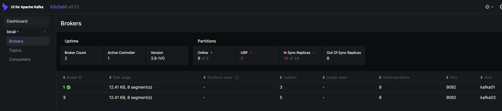

Скрипт продолжает работать. За исключением двух ошибок с таймаутами, ничего не поменялось.

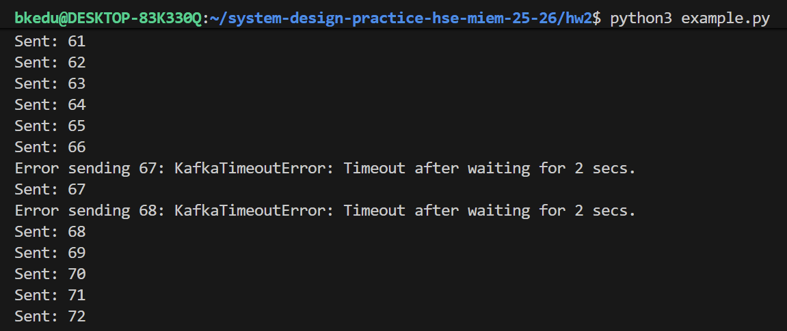

Убиваю контейнер kafka01. В выводе скрипта стало сильно больше ошибок:

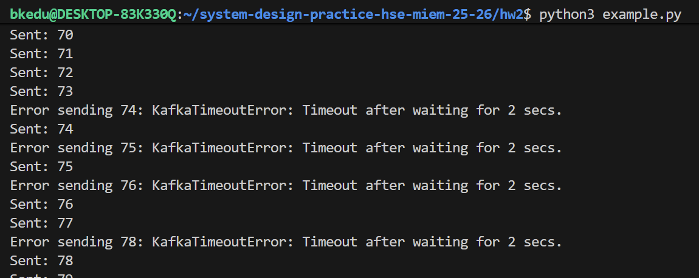

kafka-ui перестала обновлять состояние кластера. Рестарт контейнера ничего не решил:

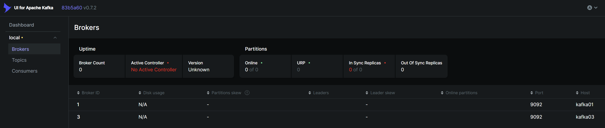

Непонятно как он считает лидером брокер kafka01, хотя такой контейнер даже не запущен:

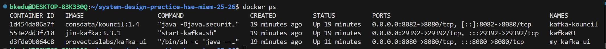

Если посмотреть в логи оставшегося контейнера, видим, что он становится кандидатом на роль лидера, но не может подключиться к оставшимся брокерам кластера:

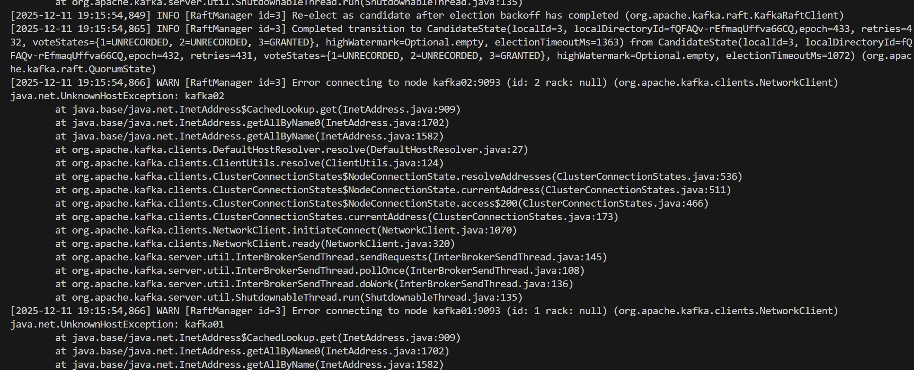

Лидером он стать не сможет, так как кластер из 1 брокера не может иметь кворум.

При этом отправка сообщений в оставшийся контейнер часто падает с таймаутом:

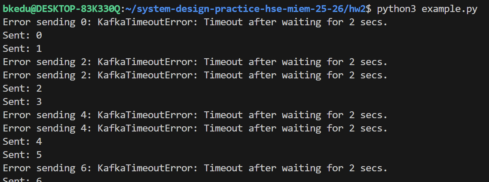

Восстановим второй брокер. В kafka-ui появилось более-менее валидное состояние кластера:

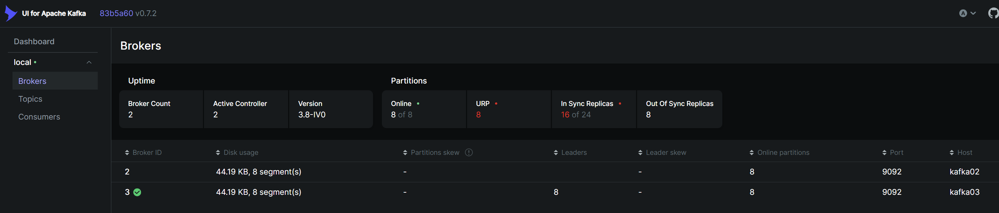

Видим, что на обоих брокерах одинаковое использование диска, то есть события с kafka03 реплицировались в kafka02, и данные в ней синхронизированы и актуальны. Leader skew == 0 и online partitions == 8, то есть реплика не отстаёт от лидера.
Ошибки отправки в скрипте пропали:

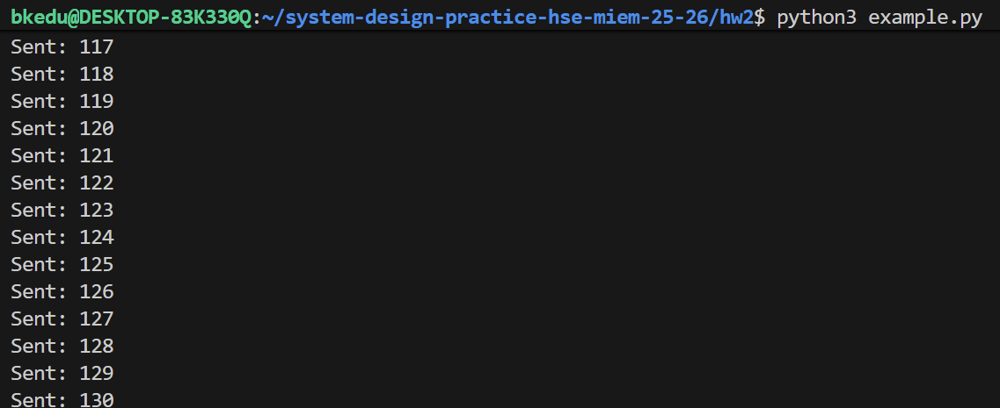

Если вернём обратно последний брокер - kafka01, то увидим в состоянии кластера статус In sync replicas == 24/24, что свидетельствует о том, что все 3 брокера синхронизированы.

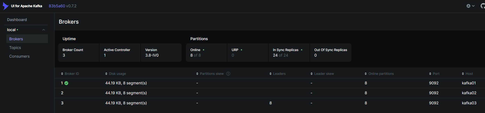

Таким образом, при восстановлении брокеры автоматически "догоняют" состояние кластера (в соответствии с настройками репликации).
